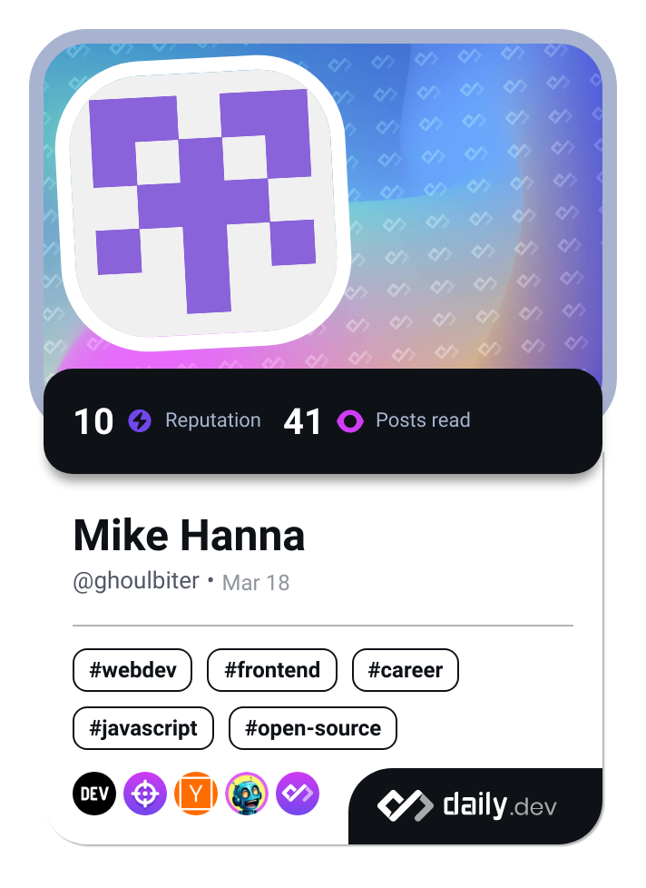

### Hi there 👋

# 💫 About Me:
I'm currently working on a real life version of Jarvis. Computer vision with semantic segmentation, text-to-speech, voice recognition and an action language model. I'm not really looking to collaborate at the moment unless I find something that intrigues me deeply. Talk to me about language models and you might find me more intrigued than not. I'm looking for help with growing my skills for a production or real-world environment, I'm good at theory and extrapolating my experiences, but have no real experiences to work with beyond my own personal projects. I'm currently learning Flutter for frontend development, Golang, Project Management and Machine Learning (to specialize later in computer vision). Ask me about anything web development and software architecture related, I'm more than happy to share ideas! Fun fact about me is that I have an extreme focus on solving peoples problems. Get me sentimental or engaged in something and I'll go so far to solve solving that you'll think I have a personal stake in it.

## 🌐 Socials:
  

# 💻 Tech Stack:
                                                                                  
# 📊 GitHub Stats:
 
 

---

<!-- Proudly created with GPRM ( https://gprm.itsvg.in ) -->

<!--
**GhoulBiter/GhoulBiter** is a ✨ _special_ ✨ repository because its `README.md` (this file) appears on your GitHub profile.

Here are some ideas to get you started:

- 🔭 I’m currently working on ...
- 🌱 I’m currently learning ...
- 👯 I’m looking to collaborate on ...
- 🤔 I’m looking for help with ...
- 💬 Ask me about ...
- 📫 How to reach me: ...
- 😄 Pronouns: ...
- ⚡ Fun fact: ...
-->
