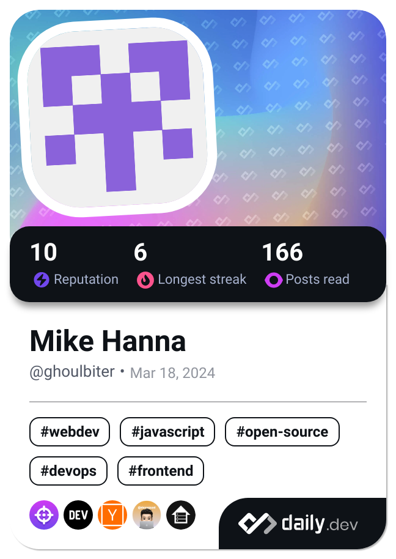

### Hi there 👋

# 💫 About Me:
I'm a passionate full-stack web developer and recent Computer Science graduate from GUtech, always eager to explore new technologies and solve real-world problems through code. My expertise spans across web development, cloud infrastructure, and database management, and I'm particularly interested in AI-driven solutions and scalable software architecture.

The biggest driver for me is solving problems—especially those that can benefit my community or make a global impact. I take great pride in identifying pain points and providing thoughtful, conscientious solutions. I believe in using innovation to improve everyday life while keeping things realistic and practical. My long-term vision is to work on projects that leverage AI across various industries, providing value to people from all walks of life. Currently, my focus is on healthcare technology, where I aim to improve the work experience of medical staff and enhance patient care and management systems through advanced, AI-integrated solutions.

I’m driven by the idea that technology can be a tool for positive change, and I’m constantly seeking out opportunities to apply my skills to new, impactful projects. Whether it's creating more efficient service booking systems or developing healthcare applications, my ultimate goal is to make the world a better, more connected place through technology.

✉️ I love collaborating on projects and exploring new ideas, so feel free to reach out to me if you’re working on something exciting or just want to chat about tech!

  

# 💻 Tech Stack:
### Languages
 
 
 
 
 
 
 
 

### Cloud & Hosting
 
 
 
 
 

### Frameworks & Libraries
 
 
 

### Style & Component Libraries
 
 

### Databases
 
 
 
 

### DevOps & Tools
 
 
 
 
 

### Design & Prototyping
 

### Machine Learning & Data Science
 
 
 

# 📊 GitHub Stats:
 
 

---

# 📕 Come Read With Me:

<!-- Proudly created with GPRM ( https://gprm.itsvg.in ) -->

<!--
**GhoulBiter/GhoulBiter** is a ✨ _special_ ✨ repository because its `README.md` (this file) appears on your GitHub profile.

Here are some ideas to get you started:

- 🔭 I’m currently working on ...
- 🌱 I’m currently learning ...
- 👯 I’m looking to collaborate on ...
- 🤔 I’m looking for help with ...
- 💬 Ask me about ...
- 📫 How to reach me: ...
- 😄 Pronouns: ...
- ⚡ Fun fact: ...
-->
